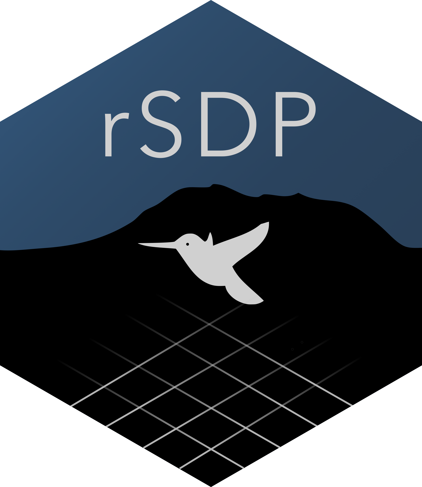

<!-- README.md is generated from README.Rmd. Please edit that file -->

```{r, include = FALSE}
knitr::opts_chunk$set(
  collapse = TRUE,
  comment = "#>",
  fig.path = "man/figures/README-",
  out.width = "100%"
)
```

# rSDP 

<!-- badges: start -->
`r lifecycle::badge('experimental')`
<!-- badges: end -->

The rSDP package provides a simple interface for discovering, querying, and subsetting data products that are incorporated into the RMBL Spatial Data Platform. The RMBL SDP provides a set of curated, high-resolution, and high-fidelity geospatial datasets for a set of domains in Western Colorado (USA) in the vicinity of [Rocky Mountain Biological Laboratory](https://rmbl.org). For more information about the RMBL SDP [see here](https://www.rmbl.org/scientists/resources/spatial-data-platform/).

SDP data products are provided as geospatial raster datasets in [cloud-optimized Geotiff]() (COG) format. The rSDP package provides functions to access these datasets in cloud storage (Amazon S3) without downloading.

## Installation

You can install the latest version of rSDP from [GitHub](https://github.com/) with:

```{r install, eval=FALSE}
# install.packages("remotes")
remotes::install_github("rmbl-sdp/rSDP")
```

## Discovering SDP Data and Metadata

The package provides functions `sdp_get_catalog()`, and `sdp_get_metadata()` that download information about what datasets are currently available and what their spatial attributes are.

```{r example}
library(rSDP)

## Gets entries for vegetation data products in the Upper Gunnison (UG) domain.
sdp_cat <- sdp_get_catalog(domains="UG", 
                           types="Vegetation",
                           deprecated=FALSE,
                           return_stac=FALSE)
sdp_cat[,1:5]
```

```{r example2}
## Grabs detailed metadata for a specific dataset.
item_meta <- sdp_get_metadata(catalog_id="R1D001",return_list=TRUE)

## Prints the detailed description.
item_description <- item_meta$qgis$abstract[[1]]
print(item_description)
```
## Accessing SDP data in the cloud.

The function `sdp_get_raster()`, creates R representations of cloud-based datasets that can be used for further processing, returning a `SpatRaster` which can be further manipulated using functions in the `terra` package.

```{r example3}
## Creates a `SpatRaster` object for a dataset.
dem <- sdp_get_raster(catalog_id="R3D009")
terra::plot(dem)
```
Alternatively, you can plot these data on a web map:

```{r example plet, eval=FALSE}
terra::plet(dem,tiles="Esri.WorldImagery")
```
## Downloading SDP data locally.

By default, `sdp_get_raster()` connects to cloud-based datasets without downloading them locally, but specifying `download_file=TRUE` and providing a local file path will download the raster data to disk. This can sometimes speed up operations that would be prohibitively slow with cloud-based data sources:

```{r example3b, eval=FALSE}
## Creates a local `SpatRaster`
dem_local <- sdp_get_raster(catalog_id="R3D009",
                            download_data=TRUE,
                            download_path="~/Downloads", 
                            overwrite=FALSE)
```

## Extracting samples of SDP data.

The function `sdp_extract_data()` extracts samples from datasets at locations represented by points, lines, or polygons.
```{r example4}
## Extracts values of an SDP dataset.
elev <- sdp_get_raster(catalog_id="R3D009")
slope <- sdp_get_raster(catalog_id="R3D012")

location_df <- data.frame(SiteName=c("Roaring Judy","Gothic","Galena Lake"),
                          Lat=c(38.716995,38.958446,39.021644),
                          Lon=c(-106.853186,-106.988934,-107.072569))
location_sv <- terra::vect(location_df,geom=c("Lon","Lat"),crs="EPSG:4327")

dem_sample <- sdp_extract_data(raster=elev,locations=location_sv)
slope_sample <- sdp_extract_data(raster=slope,locations=dem_sample)
plot(slope_sample$UG_dem_3m_v1,slope_sample$UG_dem_slope_1m_v1,xlab="Elevation (m).",
     ylab="Slope (degrees)")
```

With line or polygon locations `sdp_extract_data()` summarizes raster values by line or polygon. The default method computes the mean value for each polygon, but you can also specify other summary functions using the `sum_fun` argument. 

```{r example5}
slope <- sdp_get_raster(catalog_id="R3D012")

location_poly <- data.frame(SiteName=c("Wet","Conifer","Rocky"),
                            WKT=c("POLYGON ((327651 4313638,327620 4313727,327693 4313759, 327651 4313638))",
                                   "POLYGON ((327340 4314059,327450 4314026,327418 4313970,327340 4314059))",
                                   "POLYGON ((328193 4314314,328285 4314274,328244 4314223, 328193 4314314))"))
location_poly_sv <- terra::vect(location_poly,geom="WKT",crs="EPSG:32613")

slope_site_mean <- sdp_extract_data(raster=slope,locations=location_poly_sv)
slope_site_sd <- sdp_extract_data(raster=slope,locations=slope_site_mean,
                                  sum_fun=sd,bind=TRUE)
names(slope_site_sd) <- c("SiteName","ID","Slope_mean","ID2","Slope_sd")

plot(slope_site_sd$Slope_mean,slope_site_sd$Slope_sd,xlab="Slope Mean (deg.)",
     ylab="Slope Standard Deviation",pch="")
text(slope_site_sd$Slope_mean,slope_site_sd$Slope_sd,labels=slope_site_sd$SiteName)
```
You can also return all the cell values intersecting each line or polygon by specifying `sum_fun=NULL`. Passing the argument `exact=TRUE` with polygon features returns the proportion of each raster cell included in the polygon (useful for computing area-weighted means.)

```{r example6, warning=FALSE}
slope_allcells <- sdp_extract_data(raster=slope,locations=slope_site_mean,
                                  sum_fun=NULL,exact=TRUE,bind=FALSE)
head(slope_allcells)
```

## Working with raster time-series

The `sdp_get_raster()` and `sdp_extract_data()` functions also provide some convenience features for subsetting time-series datasets by day or year.

```{r example7}
## Connects to rasters from a temporal subset of daily data.
tmax <- sdp_get_raster("R4D004",date_start=as.Date("2011-12-01"),date_end=as.Date("2011-12-30"))

## Further subsets when extracting data
tmax_sample <- sdp_extract_data(tmax,location_sv,date_start=as.Date("2011-12-01"),date_end=as.Date("2011-12-20"))
tmax_df <- as.data.frame(tmax_sample)
dates <- as.Date(names(tmax_df)[3:ncol(tmax_sample)])
sites <- tmax_df$SiteName

##Plots the result
plot(dates,tmax_df[1,3:ncol(tmax_sample)],type="l",ylab="Tmax (C)",ylim=c(-15,7))
points(dates,tmax_df[2,3:ncol(tmax_sample)],type="l",col=3)
points(dates,tmax_df[3,3:ncol(tmax_sample)],type="l",col=4)
legend("bottomright", legend=sites,col=c(1,3,4),bty="n",lty=1)

##Retrieving rasters from a subset of years.
snow_yearly <- sdp_get_raster("R4D001",years=c(2012,2019))
terra::plot(snow_yearly,range=c(60,230))
```

## Extracting data from large time-series datasets.

For extracting subsets of large datasets, it's sometimes a good idea to loop over small subsets rather than extracting from a single large raster object with many (sometimes hundreds) of layers.

```{r example8, warning=FALSE}
## Extracts with a single call.
start1 <- Sys.time()
tmax1 <- sdp_get_raster("R4D004",date_start=as.Date("2004-10-01"),date_end=as.Date("2004-10-31"))

tmax_extr1 <- sdp_extract_data(tmax1,location_sv,verbose=FALSE)
elapsed1 <- Sys.time() - start1

## Loops over layers (different subset to avoid cacheing).
start2 <- Sys.time()
tmax2 <- sdp_get_raster("R4D004",date_start=as.Date("2005-10-01"),date_end=as.Date("2005-10-31"),
                        verbose=FALSE)
locations_proj <- terra:::project(location_sv,"EPSG:32613")

extr_list <- list()
for(i in 1:terra::nlyr(tmax2)){
  extr_dat <- sdp_extract_data(tmax2[[i]],locations_proj,verbose=FALSE)[,3]
  extr_list[[i]] <- extr_dat
}
tmax_extr2 <- do.call(cbind,extr_list)
elapsed2 <- Sys.time() - start2

## Loops over creating the raster object itself. 
## This is slower single threaded, but can be more easily made parallel.
start3 <- Sys.time()
days <- seq(as.Date("2006-10-01"),as.Date("2006-10-31"),by="day")
extr_list3 <- list()
for(i in 1:length(days)){
  tmax3 <- sdp_get_raster("R4D004",date_start=days[i],date_end=days[i],verbose=FALSE)
  extr_dat <- sdp_extract_data(tmax3,locations_proj,verbose=FALSE)[,3]
  extr_list3[[i]] <- extr_dat
}
tmax_extr3 <- do.call(cbind,extr_list3)
elapsed3 <- Sys.time() - start3

## Parallel extraction via foreach.
library(foreach)
library(doParallel)
library(sf)

## Can't pass SpatVector or SpatRaster objects via Foreach, so convert to sf.
locations_sf <- st_as_sf(location_sv)

start4 <- Sys.time()
cl <- parallel::makeCluster(4)
doParallel::registerDoParallel(cl)
days <- seq(as.Date("2007-10-01"),as.Date("2007-10-31"),by="day")

extr_list4 <- foreach::foreach(i=1:length(days),.packages=c("sf","terra","rSDP")) %dopar% {
  tmax4 <- sdp_get_raster("R4D007",date_start=days[i],
                         date_end=days[i],verbose=FALSE)
   locations_sv <- vect(locations_sf)
   extr_dat <- sdp_extract_data(tmax4,locations=locations_sv,
                                verbose=FALSE,return_type="sf")[,4]
   (st_drop_geometry(extr_dat))
}
parallel::stopCluster(cl)
tmax_extr4 <- do.call(cbind,extr_list4)
elapsed4 <- Sys.time() - start4

##Collects timings.
timings <- data.frame(approach=c("Single Call","Looping sdp_extract_data()","Looping over sdp_get_raster()","Foreach"),
                      timing=c(elapsed1,elapsed2,elapsed3,elapsed4))
timings
```
