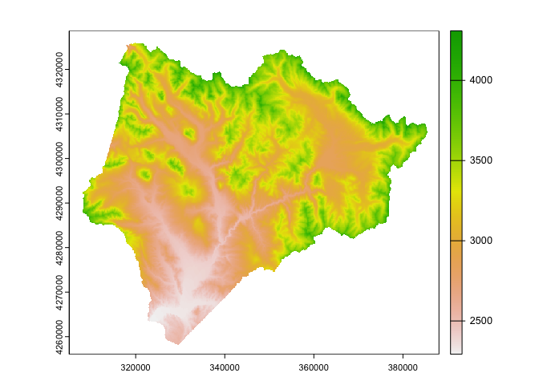
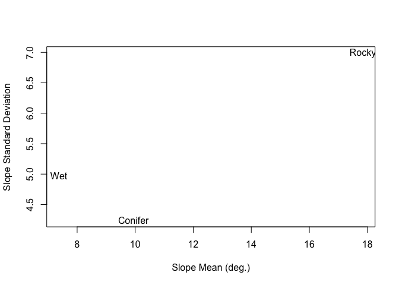

<!-- README.md is generated from README.Rmd. Please edit that file -->

# rSDP

<!-- badges: start -->
<!-- badges: end -->

The rSDP package provides a simple interface for discovering, querying,
and subsetting data products that are incorporated into the RMBL Spatial
Data Platform. The RMBL SDP provides a set of curated, high-resolution,
and high-fidelity geospatial datasets for a set of domains in Western
Colorado (USA) in the vicinity of [Rocky Mountain Biological
Laboratory](https://rmbl.org). For more information about the RMBL SDP
[see
here](https://www.rmbl.org/scientists/resources/spatial-data-platform/).

SDP data products are provided as geospatial raster datasets in
[cloud-optimized Geotiff]() (COG) format. The rSDP package provides
functions to access these datasets in cloud storage (Amazon S3) without
downloading.

## Installation

You can install the development version of rSDP from
[GitHub](https://github.com/) with:

``` r
# install.packages("devtools")
devtools::install_github("rmbl-sdp/rSDP")
```

## Discovering SDP Data and Metadata

The package provides functions `sdp_get_catalog()`, and
`sdp_get_metadata()` that download information about what datasets are
currently available and what their spatial attributes are.

``` r
library(rSDP)

## Gets entries for vegetation data products in the Upper Gunnison (UG) domain.
sdp_cat <- sdp_get_catalog(domains="UG", 
                           types="Vegetation",
                           deprecated=FALSE,
                           return_stac=FALSE)
sdp_cat[,1:5]
#>    CatalogID  Release       Type                       Product Domain
#> 54    R3D013 Release3 Vegetation              Understory Cover     UG
#> 55    R3D014 Release3 Vegetation       Vegetation Canopy Cover     UG
#> 56    R3D015 Release3 Vegetation      Vegetation Canopy Height     UG
#> 57    R3D016 Release3 Vegetation 20th Percentile Canopy Height     UG
#> 58    R3D017 Release3 Vegetation 80th Percentile Canopy Height     UG
#> 59    R3D018 Release3 Vegetation               Basic Landcover     UG
#> 60    R3D019 Release3 Vegetation        October 2017 NAIP NDVI     UG
#> 61    R3D020 Release3 Vegetation       Septober 2019 NAIP NDVI     UG
#> 73     BM012 Basemaps Vegetation      Canopy Structure Basemap     UG
#> 74     BM013 Basemaps Vegetation             Landcover Basemap     UG
```

``` r
## Grabs detailed metadata for a specific dataset.
item_meta <- sdp_get_metadata(catalog_id="R1D001",return_list=TRUE)

## Prints the detailed description.
item_description <- item_meta$qgis$abstract[[1]]
print(item_description)
#> [1] "This map represents estimated stream flowlines from a hydrologically corrected digital elevation model. The lines were derived in GRASS GIS using a multi-direction algorithm that allows channel braiding. Each stream segment is identified by a unique integer. Stream lines were delineated for drainage areas greater than 512000 square meters.\n"
```

## Accessing SDP data in the cloud.

The function `sdp_get_raster()`, creates R representations of
cloud-based datasets that can be used for further processing, returning
a `SpatRaster` which can be further manipulated using functions in the
`terra` package.

``` r
## Creates a `SpatRaster` object for a dataset.
dem <- sdp_get_raster(catalog_id="R3D009")
terra::plot(dem)
```



The function `sdp_extract_data()` extracts samples from datasets at
locations represented by points, lines, or polygons.

``` r
## Extracts values of an SDP dataset.
elev <- sdp_get_raster(catalog_id="R3D009")
slope <- sdp_get_raster(catalog_id="R3D012")

location_df <- data.frame(SiteName=c("Roaring Judy","Gothic","Galena Lake"),
                          Lat=c(38.716995,38.958446,39.021644),
                          Lon=c(-106.853186,-106.988934,-107.072569))
location_sv <- terra::vect(location_df,geom=c("Lon","Lat"),crs="EPSG:4327")

dem_sample <- sdp_extract_data(raster=elev,locations=location_sv)
#> [1] "Re-projecting locations to coordinate system of the raster."
#> [1] "Extracting data at 3 locations for 1 raster layers."
#> [1] "Extraction complete."
slope_sample <- sdp_extract_data(raster=slope,locations=dem_sample)
#> [1] "Extracting data at 3 locations for 1 raster layers."
#> [1] "Extraction complete."
plot(slope_sample$UG_dem_3m_v1,slope_sample$UG_dem_slope_1m_v1,xlab="Elevation (m).",
     ylab="Slope (degrees)")
```

 The
`sdp_get_raster()` and `sdp_extract_data()` functions also provide some
convenience features for subsetting time-series datasets by day or year.

``` r
## Connects to rasters from a temporal subset of daily data.
tmax <- sdp_get_raster("R4D004",date_start=as.Date("2011-12-01"),date_end=as.Date("2011-12-30"))
#> [1] "Returning dataset with 30 layers, be patient..."

## Further subsets when extracting data
tmax_sample <- sdp_extract_data(tmax,location_sv,date_start=as.Date("2011-12-01"),date_end=as.Date("2011-12-20"))
#> [1] "Re-projecting locations to coordinate system of the raster."
#> [1] "Extracting data at 3 locations for 20 raster layers."
#> [1] "Extraction complete."
tmax_df <- as.data.frame(tmax_sample)
dates <- as.Date(names(tmax_df)[3:ncol(tmax_sample)])
sites <- tmax_df$SiteName

##Plots the result
plot(dates,tmax_df[1,3:ncol(tmax_sample)],type="l",ylab="Tmax (C)",ylim=c(-15,7))
points(dates,tmax_df[2,3:ncol(tmax_sample)],type="l",col=3)
points(dates,tmax_df[3,3:ncol(tmax_sample)],type="l",col=4)
legend("bottomright", legend=sites,col=c(1,3,4),bty="n",lty=1)
```



``` r

##Retrieving rasters from a subset of years.
snow_yearly <- sdp_get_raster("R4D001",years=c(2012,2019))
#> [1] "Returning dataset with 2 layers be patient..."
#terra::plot(snow_yearly,range=c(60,230),maxcell=5000)
```

## Extracting data from large time-series datasets.

For extracting subsets of large datasets, it’s sometimes a good idea to
loop over small subsets rather than extracting from a single large
raster object with many (sometimes hundreds) of layers.

``` r
## Extracts with a single call.
start1 <- Sys.time()
tmax1 <- sdp_get_raster("R4D004",date_start=as.Date("2004-10-01"),date_end=as.Date("2004-10-31"))
#> [1] "Returning dataset with 31 layers, be patient..."

tmax_extr1 <- sdp_extract_data(tmax1,location_sv,verbose=FALSE)
elapsed1 <- Sys.time() - start1

## Loops over layers (different subset to avoid cacheing).
start2 <- Sys.time()
tmax2 <- sdp_get_raster("R4D004",date_start=as.Date("2005-10-01"),date_end=as.Date("2005-10-31"),
                        verbose=FALSE)
locations_proj <- terra:::project(location_sv,"EPSG:32613")

extr_list <- list()
for(i in 1:terra::nlyr(tmax2)){
  extr_dat <- sdp_extract_data(tmax2[[i]],locations_proj,verbose=FALSE)[,3]
  extr_list[[i]] <- extr_dat
}
tmax_extr2 <- do.call(cbind,extr_list)
elapsed2 <- Sys.time() - start2

## Loops over creating the raster object itself. 
## This is slower single threaded, but can be more easily made parallel.
start3 <- Sys.time()
days <- seq(as.Date("2006-10-01"),as.Date("2006-10-31"),by="day")
extr_list3 <- list()
for(i in 1:length(days)){
  tmax3 <- sdp_get_raster("R4D004",date_start=days[i],date_end=days[i],verbose=FALSE)
  extr_dat <- sdp_extract_data(tmax3,locations_proj,verbose=FALSE)[,3]
  extr_list3[[i]] <- extr_dat
}
tmax_extr3 <- do.call(cbind,extr_list3)
elapsed3 <- Sys.time() - start3

## Parallel extraction via foreach.
library(foreach)
#> Warning: package 'foreach' was built under R version 4.1.2
library(doParallel)
#> Warning: package 'doParallel' was built under R version 4.1.2
#> Loading required package: iterators
#> Warning: package 'iterators' was built under R version 4.1.2
#> Loading required package: parallel

start4 <- Sys.time()
##cl <- parallel::makeCluster(4)
##doParallel::registerDoParallel(cl)
days <- seq(as.Date("2007-10-01"),as.Date("2007-10-31"),by="day")

extr_list4 <- foreach::foreach(i=1:length(days),.packages=c("terra","devtools")) %do% {
  devtools::load_all() ## During package development.
  tmax4 <- rSDP::sdp_get_raster("R4D004",date_start=days[i],date_end=days[i],verbose=FALSE)
  extr_dat <- rSDP::sdp_extract_data(tmax4,locations_proj,verbose=FALSE)[,3]
  (extr_dat)
}
#> Warning: package 'terra' was built under R version 4.1.2
#> terra 1.6.17
#> Loading required package: usethis
#> ℹ Loading rSDP
#> ℹ Loading rSDP
#> ℹ Loading rSDP
#> ℹ Loading rSDP
#> ℹ Loading rSDP
#> ℹ Loading rSDP
#> ℹ Loading rSDP
#> ℹ Loading rSDP
#> ℹ Loading rSDP
#> ℹ Loading rSDP
#> ℹ Loading rSDP
#> ℹ Loading rSDP
#> ℹ Loading rSDP
#> ℹ Loading rSDP
#> ℹ Loading rSDP
#> ℹ Loading rSDP
#> ℹ Loading rSDP
#> ℹ Loading rSDP
#> ℹ Loading rSDP
#> ℹ Loading rSDP
#> ℹ Loading rSDP
#> ℹ Loading rSDP
#> ℹ Loading rSDP
#> ℹ Loading rSDP
#> ℹ Loading rSDP
#> ℹ Loading rSDP
#> ℹ Loading rSDP
#> ℹ Loading rSDP
#> ℹ Loading rSDP
#> ℹ Loading rSDP
#> ℹ Loading rSDP
##parallel::stopCluster(cl)
tmax_extr4 <- do.call(cbind,extr_list4)
elapsed4 <- Sys.time() - start4

##Collects timings.
timings <- data.frame(approach=c("Single Call","Looping sdp_extract_data()","Looping over sdp_get_raster()","Foreach"),
                      timing=c(elapsed1,elapsed2,elapsed3,elapsed4))
timings
#>                        approach        timing
#> 1                   Single Call 21.34864 secs
#> 2    Looping sdp_extract_data() 40.00386 secs
#> 3 Looping over sdp_get_raster() 58.16944 secs
#> 4                       Foreach 63.89897 secs
```
